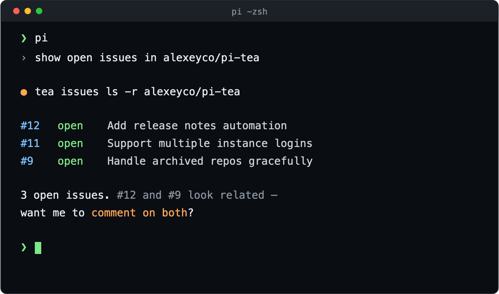

# pi-tea

[Forgejo](https://forgejo.org) / [Gitea](https://gitea.io) skill for the [pi](https://pi.dev) coding agent.

Teaches the agent to drive the [`tea`](https://gitea.com/gitea/tea) CLI: browse repos, issues, pulls, releases, branches, comments and notifications. Read-only by default; anything state-changing requires explicit confirmation.

<p align="center">
  
</p>

## Install

```sh
pi install npm:pi-tea
# or pinned to a git ref
pi install git:github.com/alexeyco/pi-tea@v0.1.0
```

Requires the `tea` CLI and a configured login (`tea login add`).

## Usage

Ask in natural language; pi loads the skill when relevant:

- “List open issues in `owner/repo`, most recent first.”
- “Summarize PR #42, including the comments.”
- “What’s in the latest release of `owner/repo`?”
- “Any unread notifications?”

State-changing actions (commenting, creating issues, merging) are proposed
as exact commands and run only after you confirm.

## See also

- [CONTRIBUTING.md](CONTRIBUTING.md) — development and release workflow.
